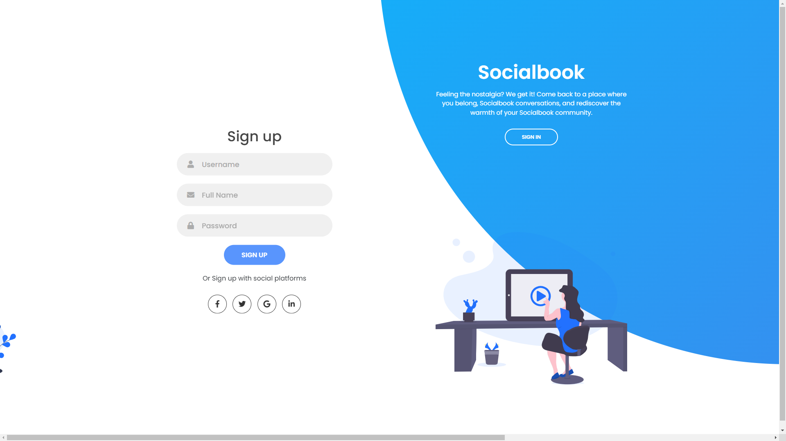
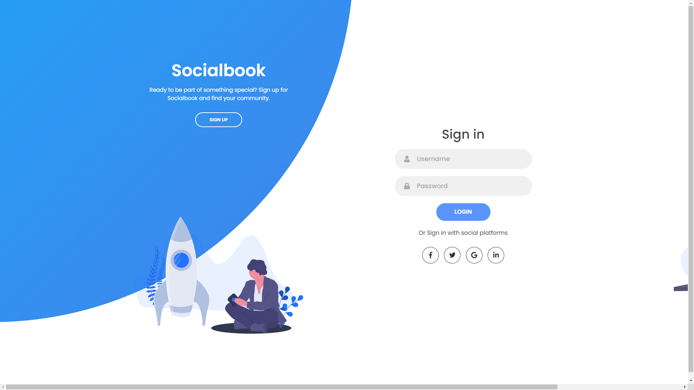
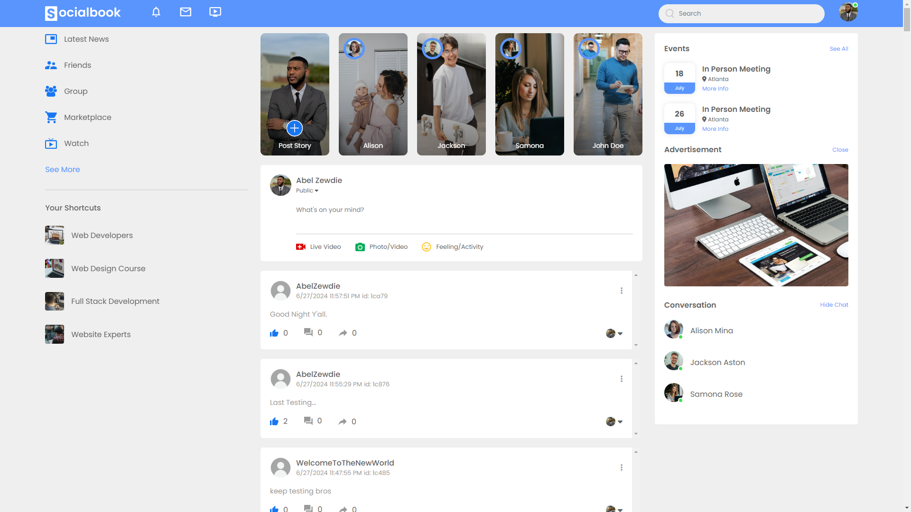
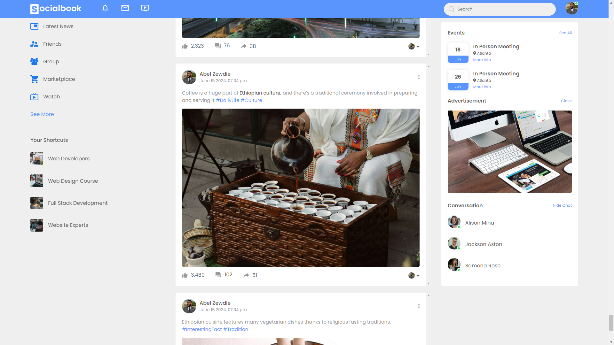
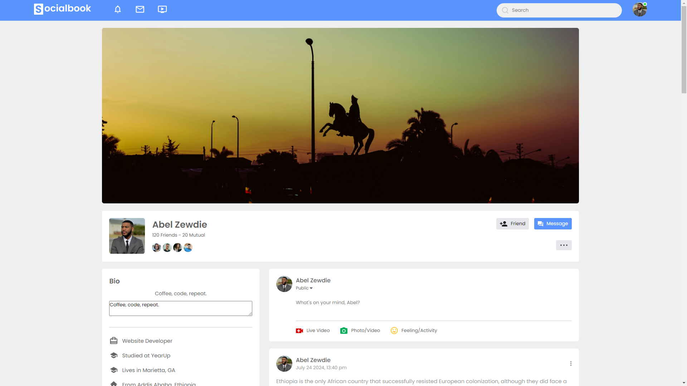
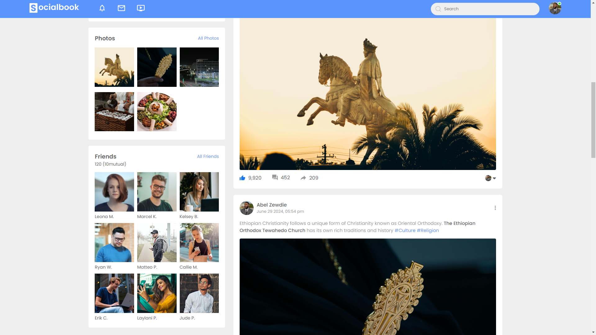
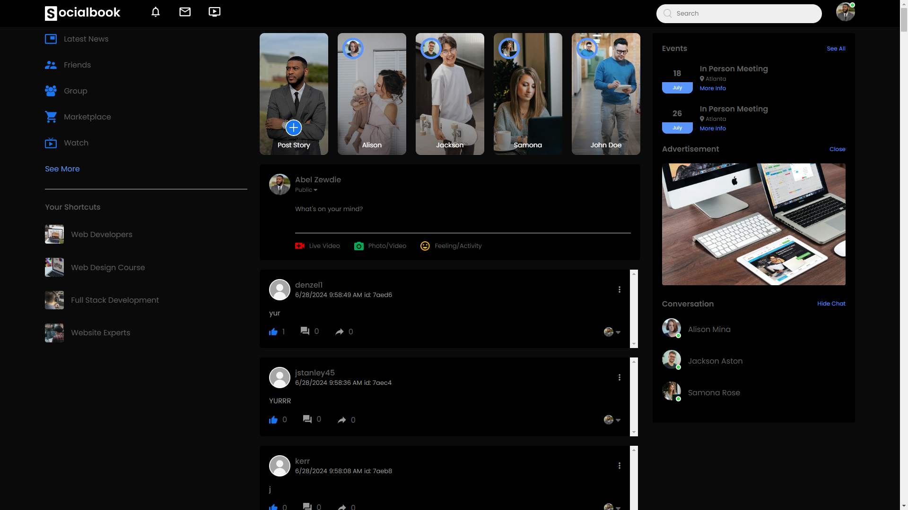
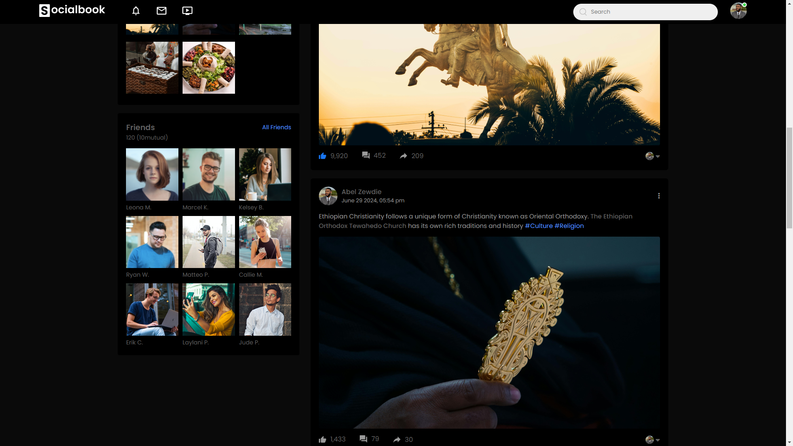

# `Socialbook` | MicroBlog

## Register/LogIn Page

| **Become part of our growing community. Register today and connect with like-minded individuals who share your interests.**                     | **Your thoughts and connections are waiting. Sign in to dive back into your microblogging experience.**                 |
|---------------------------|---------------------------|
|  |  |

<hr>

## Post Page
* **Capture the moment! Upload your photos and videos and share them with the world in Socialbook.**

| **Give it a thumbs up! Like a post to show your appreciation for the content.**                    | **Share a captivating image or video and tell your story**                 |
|---------------------------|---------------------------|
|  |  |
<hr>

## Profile Page
* **Explore your profile to see your latest posts, followers, and who you follow. This is your space! Your profile showcases your microblogging journey, including your posts and connections.**

| **Keeping it current! Bios are like mini online resumes, and people update them to showcase their latest developments.**                    | **Stay in the know! Take a moment to review your profile and ensure your information is up-to-date.**                 |
|---------------------------|---------------------------|
|  |  |
<hr>


## DarkMode
| **Get the modern look! Activate dark mode for a contemporary aesthetic on your profile and posts.**                    | **Dim the lights, soothe your eyes. Dark mode offers a relaxing view for your profile and post pages.**                 |
|---------------------------|---------------------------|
|  |  |
<hr>


## Favorite Code | `Register/LogIn Page Javascript`
* **writing this code helped me learn new concepts about JavaScript.** <hr>
```
const sign_in_btn = document.querySelector("#sign-in-btn");
const sign_up_btn = document.querySelector("#sign-up-btn");
const container = document.querySelector(".container");

sign_up_btn.addEventListener("click", () => {
  container.classList.add("sign-up-mode");
});

sign_in_btn.addEventListener("click", () => {
  container.classList.remove("sign-up-mode");
});
```

## For live site you can click here.
https://abelzewdie.github.io/microblog-capstone/